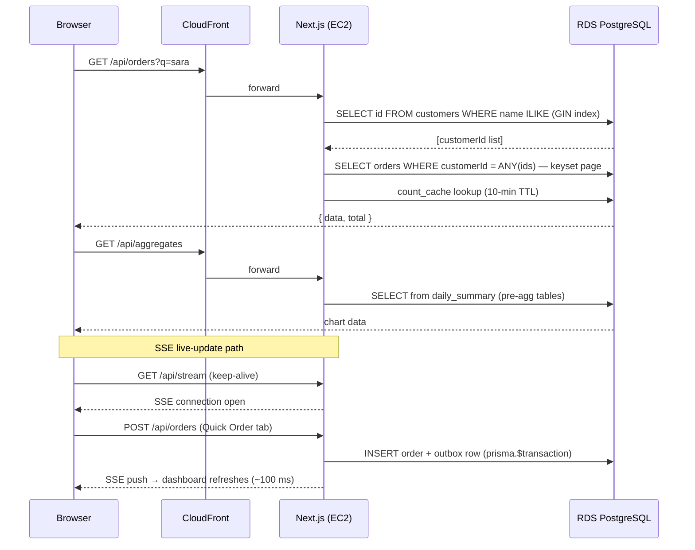

# Dashboard — Next.js + Prisma + AWS RDS

Production-grade **Next.js 16 / TypeScript** full-stack orders dashboard delivering sub-second search
and chart responses across 500 k orders: full-text search, pre-aggregated analytics tables,
persistent count cache, Server-Sent Events for live updates, and Terraform IaC on AWS.

---

## Live Service

| Endpoint | URL |
|---|---|
| **App** | available on demand |
| **Portfolio demo** | https://bganguly.github.io/#nextjs_dashboard |

> Requires AWS RDS PostgreSQL; run deploy.sh to provision and start the service.

---

## Using the App

1. **Search** — type in the search bar to find orders by customer name; sub-second via customer-id enumeration + GIN index on 500 k rows.
2. **Aggregates** — the chart shows daily order totals by category from pre-aggregated tables; never touches raw orders.
3. **Live updates** — open a second tab to the Quick Order tool and place an order; the dashboard refreshes within ~100 ms via SSE.

---

## Stack

| Component | Implementation |
|---|---|
| **Next.js / TypeScript full-stack** | Next.js 16, React 19, TypeScript, Tailwind CSS, Recharts |
| **PostgreSQL — SQL, performance tuning** | AWS RDS PG 16; Prisma migrations; GIN index; pre-aggregated summary tables; persistent `count_cache` (10-min TTL) for sub-second pagination counts on 500 k rows |
| **IaC** | Terraform (`infra/main.tf`) — VPC, subnets, security groups, RDS PostgreSQL |
| **CI/CD** | `deploy.sh` — single entry point: provisions AWS infra if needed, applies Prisma schema + SQL migrations, builds and starts the app |
| **Real-time updates** | Server-Sent Events (`/api/stream`) — new orders pushed live to all connected dashboard tabs without polling |
| **Networking** | AWS VPC + public subnets; RDS locked to caller IP via security group |
| **Performance optimization** | Sub-second ILIKE via customer-id enumeration + GIN index on customers; persistent `count_cache` eliminates repeat COUNT(*) scans; pre-agg tables for chart; startup warmup pre-seeds cache for first-page tokens |
| **System design diagrams** | See architecture section below |

---

## Architecture

### Search & chart request flow — step by step

1. **Browser → CloudFront → Next.js** — the React UI sends `GET /api/orders?q=sara` to the CloudFront distribution, which proxies to the Next.js API route on EC2.
2. **Customer-id enumeration** — Next.js issues `SELECT id FROM customers WHERE name ILIKE '%sara%'` against RDS; the GIN index on `(firstName, lastName)` keeps this sub-second across 500 k customers.
3. **Order join** — Next.js follows with `SELECT orders WHERE customerId = ANY(ids)` keyset-paginated by `(placedAt DESC, id DESC)`; the `count_cache` table (10-min TTL) serves the total without a COUNT(*) scan.
4. **Chart path** — `GET /api/aggregates` reads from pre-aggregated `daily_summary` and related rollup tables — never touches raw orders; millisecond response.
5. **SSE live updates** — a dashboard tab holds an open `GET /api/stream` connection. When the Quick Order tool posts a new order, Next.js writes the order + an outbox row in one `prisma.$transaction`, then calls `publishOrderEvent()`; the SSE stream pushes the event to all connected tabs within ~100 ms.



### Topology

```
┌─────────────────────────────────────────────────────────────────────────┐
│                              AWS Account                                │
│                                                                         │
│   Terraform (infra/main.tf)                                             │
│   manages all resources below                                           │
│                                                                         │
│   ┌───────────────────────────────────────────────────────────────┐     │
│   │                    dash-test-vpc (10.42.0.0/16)               │     │
│   │                                                               │     │
│   │   public-a / public-b subnets                                 │     │
│   │   ┌──────────────────────────────────────────────────────┐    │     │
│   │   │  Next.js (port 3004) — EC2                           │    │     │
│   │   │  • REST /api/orders, /api/customers, /api/regions    │    │     │
│   │   │  • /api/aggregates (chart)                           │    │     │
│   │   │  • /api/stream  (SSE — live order events)            │    │     │
│   │   │  • Prisma $queryRaw + pre-agg table reads            │    │     │
│   │   └──────────────────────┬───────────────────────────────┘    │     │
│   │                          │ Prisma / pg                        │     │
│   │   ┌───────────────────────▼──────────────────────────────┐    │     │
│   │   │  AWS RDS PostgreSQL 16 (db.m5.xlarge)                │    │     │
│   │   │  • orders           (500 k rows)                       │    │     │
│   │   │  • customers + regions + products                    │    │     │
│   │   │  • GIN index on customers(firstName,lastName)        │    │     │
│   │   │  • pre-agg summary tables for chart queries          │    │     │
│   │   │  • count_cache (10-min TTL pagination counts)        │    │     │
│   │   │  • Prisma migrations V1–V11                          │    │     │
│   │   └──────────────────────────────────────────────────────┘    │     │
│   └───────────────────────────────────────────────────────────────┘     │
└─────────────────────────────────────────────────────────────────────────┘

Deploy flow
───────────
local machine
  └─ deploy.sh
       ├─ database-url.sh → resolve DATABASE_URL (or run infra-up.sh)
       ├─ prisma db push   → sync schema to RDS
       ├─ psql migration.sql × N  → apply SQL migration files
       ├─ npm run build
       └─ npm start        → start Next.js on :3004

Real-time flow (SSE)
────────────────────
Quick Order (port 3005, bganguly/websockets-quickorder)
  └─ POST /api/orders → Next.js
       └─ publishOrderEvent()
            └─ /api/stream (SSE) → all open dashboard browser tabs refresh live
```

### Key design decisions

| Concern | Approach |
|---|---|
| **Search performance** | Customer-id enumeration (`SELECT id FROM customers WHERE name ILIKE`) then `customerId = ANY(ids)` join on orders — avoids full-table ILIKE scan; GIN index on customers covers the probe |
| **Chart performance** | Pre-aggregated `daily_summary`, `daily_customer_category_summary`, `daily_status_category_summary`, `daily_filter_category_summary` — chart queries never touch raw orders |
| **Count performance** | Persistent `count_cache` table (10-min TTL) + startup warmup for first-page tokens — eliminates repeat COUNT(*) scans on 500 k rows |
| **Sort stability** | `placedAt DESC, id DESC` tiebreaker on all sort fields — prevents row duplication or skipping across pages |
| **Real-time** | SSE over HTTP long-poll — no WebSocket server needed; compatible with Next.js API routes; dashboard updates within ~100 ms of order creation |

---

## Scale & Performance

> **500 k orders** in AWS RDS PostgreSQL 16 — sub-second full-text search via customer-id enumeration + GIN index; millisecond chart aggregates from pre-aggregated tables; `count_cache` removes the COUNT bottleneck on repeat queries.

```
Browser ──HTTP──► Next.js API routes ──Prisma──► AWS RDS PG 16
                  (port 3004)                    VPC · 500 k rows · GIN index
                            ▲
             Terraform IaC (infra/main.tf)
```

---

## Deployment / Running

```bash
./scripts/deploy.sh      # local [1] or AWS RDS [2]
./scripts/infra-down.sh  # stop local [1] or teardown AWS [2]
```

### Cost control — scheduled 8am–5pm Pacific window (weekdays)

EC2 auto-stops on a weekday schedule managed by EventBridge Scheduler. **RDS runs 24/7** — stopping it flushes PostgreSQL `shared_buffers`, making the first search of every morning cold (~1 s on EBS). Keeping RDS up matches the GCP pattern where the Postgres VM never stops.

| Resource | Scale-up | Scale-down | Idle cost | ~$/mo ¹ |
|---|---|---|---|---|
| **EC2 t3.small** (lite & full) | 8am PT Mon–Fri | 5pm PT Mon–Fri | ~$0 (stopped) | ~$4 |
| **RDS db.t3.micro** (lite) + 20 GB storage | always-on | always-on | billed continuously | ~$14 |
| **RDS db.t3.large** (full) + 50 GB storage | always-on | always-on | billed continuously | ~$110 |
| **Lite total** | | | | **~$18/mo** |
| **Full total** | | | | **~$124/mo** |

¹ EC2 ≈ 200 hrs/month active (scheduled); RDS 720 hrs/month. On-demand us-east-1 pricing.

> **Savings if you also stop RDS on schedule** (~$8/mo lite, ~$75/mo full): re-enable by adding back `start_rds` / `stop_rds` schedules in `infra/main.tf` — at the cost of cold-cache first-search latency each morning.

`./scripts/deploy.sh` shows an interactive prompt at the top of every remote run:

```
  EC2: running       RDS: available (always-on)
  Auto-schedule: starts 8 am · stops 5 pm · weekdays Pacific · state=ENABLED
  [1] Start now  [2] Stop now  [3] Suspend schedule  [4] Resume schedule  [enter] Continue:
```

> **Note:** AWS auto-restarts a stopped RDS instance after 7 continuous days — the weekday schedule prevents this from happening unintentionally.

---

## Live Service

> **Schedule:** EC2 runs weekdays 8 am – 5 pm PT (EventBridge auto-start/stop). Outside those hours the app is offline and shows a maintenance page.

| | URL |
|---|---|
| **Dashboard** | https://df9jh7fbcc9nk.cloudfront.net |
| **API Explorer** | https://df9jh7fbcc9nk.cloudfront.net/api-explorer |

```bash
# local
BASE=http://localhost:3004
curl "$BASE/api/orders?page=1&pageSize=3" | jq .total
curl "$BASE/api/orders?q=sara+frank&page=1&pageSize=3" | jq '.data[].customer'
curl "$BASE/api/aggregates?from=2024-01-01&to=2024-12-31" | jq 'length'

# AWS — updated by deploy.sh on each successful deploy
BASE=https://df9jh7fbcc9nk.cloudfront.net
curl "$BASE/api/orders?page=1&pageSize=3" | jq .total
curl "$BASE/api/orders?q=sara+frank&page=1&pageSize=3" | jq '.data[].customer'
curl "$BASE/api/aggregates?from=2024-01-01&to=2024-12-31" | jq 'length'
```

---

## Snapshot / Demo Data

Seeding 4 M orders takes ~15-20 min. A maintainer can bake a `pg_dump` snapshot to a private S3
object and restore it in minutes:

```bash
DEMO_SNAPSHOT_S3_URI=s3://<bucket>/dash/demo.dump ./scripts/bake-demo-snapshot.sh

DEMO_SNAPSHOT_S3_URI=s3://<bucket>/dash/demo.dump ./scripts/prepare-demo-data.sh
```

Developers cloning from GitHub have no S3 access and automatically fall back to the full seed path.

